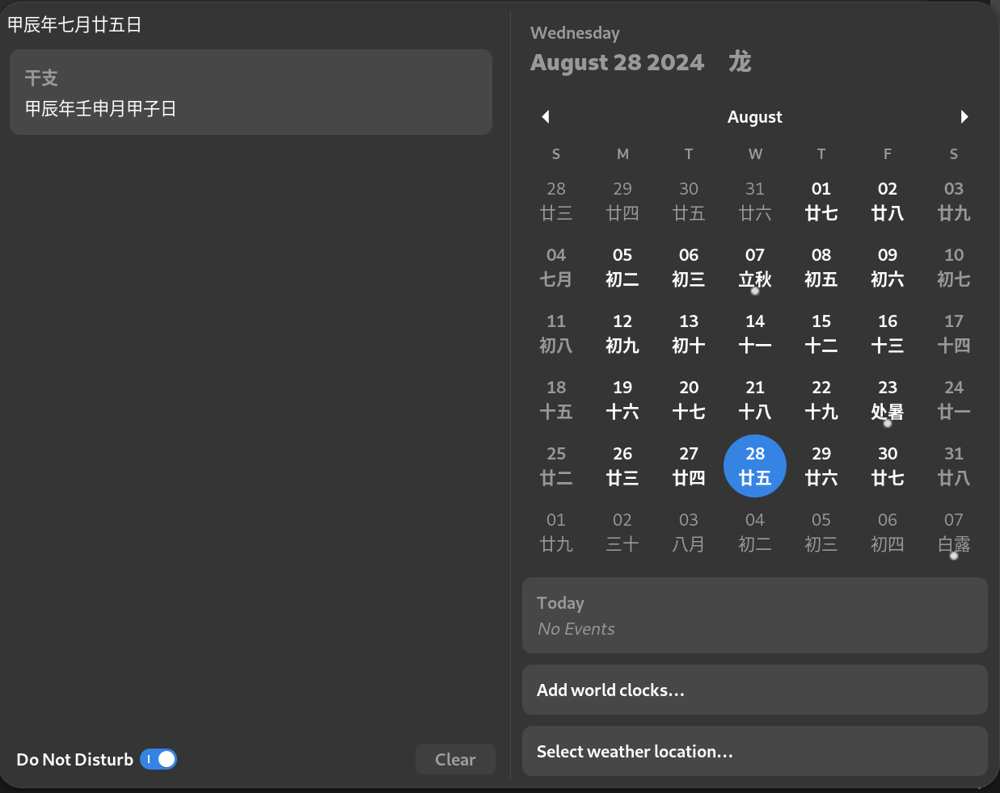

# Lunar Calendar 农历 (gnome shell extension)

## changelog

* Support change locale in extension settings, Mix of English and Chinese in calendar show

## install

```sh
sudo apt install gir1.2-lunardate-3.0
sudo apt install liblunar-date-3.0-1

# gen locales for zh_*.UTF-8
sudo sed -i -E '/# zh_.*\.UTF-8/s/^# //g' /etc/locale.gen
sudo locale-gen

cd lunar-calendar
make && make install

```

## Screenshot


